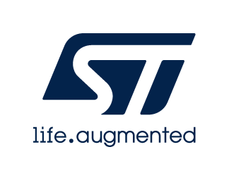

::: {.row}
::: {.col-sm-12 .col-lg-4}

# Release Notes for <mark>X-CUBE-USB-UVC Application</mark>
Copyright &copy; 2023 STMicroelectronics\
    
{.logo}

# Purpose

Standalone webcam application for STM32H747I-DISCO. 

## Key Features

- Enables photo and video capture for Machine Learning dataset creation and/or
  enrichment.
- Enables live testing of Machine Learning models on the host with the same
  camera modules as the target camera module.

:::

::: {.col-sm-12 .col-lg-8}
# Update history

::: {.collapse}
<input type="checkbox" id="collapse-section10A1" checked aria-hidden="true"/>
<label for="collapse-section10A1" aria-hidden="true">__V1.0.0 / December 2023__</label>

## Enhancements, new features and limitations

 First release

## Available documentation

<strong><a href="README.md">README</a></strong>

:::

:::
:::

<footer class="sticky">
::: {.columns}
::: {.column width="95%"}
:::
:::
</footer>

